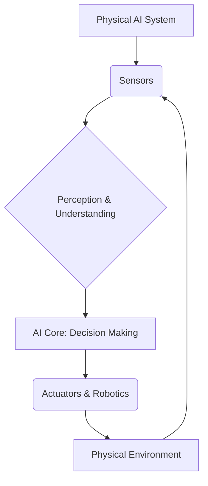

# Why Physical AI Matters

## 1. Introduction to Physical AI

Physical AI refers to artificial intelligence systems designed to interact with and operate within the physical world. Unlike purely digital AI, which resides in software, Physical AI embodies intelligence in robots and autonomous systems, enabling them to perceive, reason, and act in real-world environments. This module explores the foundational importance of Physical AI in shaping the future of technology and human interaction.

## 2. The Problem: Limitations of Digital-Only AI

While digital AI excels in tasks like data analysis, natural language processing, and virtual simulations, it often struggles when faced with the complexities and unpredictability of the physical world. Challenges include:
*   **Embodiment Gap**: Lack of a physical body to interact with objects and environments.
*   **Sensorimotor Skills**: Difficulty in performing dexterous manipulation, navigation, and real-time adaptation.
*   **Unstructured Environments**: Real-world scenarios are dynamic, messy, and lack the clean data often available in digital domains.

## 3. The Solution: Bridging the Gap with Physical AI

Physical AI addresses these limitations by integrating advanced AI algorithms with robotic hardware. This allows intelligent systems to:
*   **Perceive**: Use sensors (cameras, LiDAR, tactile sensors) to understand their surroundings.
*   **Reason**: Process sensory data, make decisions, and plan actions based on real-world physics and constraints.
*   **Act**: Manipulate objects, move through space, and interact with humans and other machines safely and efficiently.

## 4. Key Components of Physical AI Systems

Physical AI systems typically combine several critical technologies:
*   **Robotics**: Hardware platforms, actuators, and end-effectors.
*   **Sensing**: Vision systems, force sensors, proprioceptors.
*   **AI Algorithms**: Machine learning (reinforcement learning, deep learning), computer vision, control theory, motion planning.
*   **Human-Robot Interaction (HRI)**: Safe and intuitive collaboration interfaces.

## 5. Real-World Examples: Humanoid Robots

Humanoid robots are a prime example of Physical AI in action, demonstrating the potential for versatile, human-like interaction and manipulation.

### Tesla Optimus
Tesla's Optimus bot is designed to perform repetitive, mundane, or dangerous tasks, initially in manufacturing. It aims to achieve general-purpose humanoid capabilities, leveraging Tesla's AI advancements in perception and control.

_Figure 1: Conceptual rendering of Tesla Optimus._

### Figure 01
Figure 01 is another advanced humanoid robot focusing on practical applications in logistics and manufacturing. It emphasizes robust manipulation skills and sophisticated bipedal locomotion, showcasing the ability to learn and adapt to various tasks.

_Figure 2: Conceptual rendering of Figure 01._

## 6. Benefits and Applications

The development of Physical AI promises transformative benefits across numerous sectors:
*   **Manufacturing and Logistics**: Automation of complex assembly, sorting, and handling tasks.
*   **Healthcare**: Assisting in surgeries, patient care, and rehabilitation.
*   **Exploration**: Operating in hazardous environments (space, deep sea, disaster zones).
*   **Service Industry**: Personal assistants, elder care, and educational aids.
*   **Agriculture**: Precision farming and harvesting.

## 7. Challenges and Future Directions

Despite rapid progress, Physical AI faces ongoing challenges:
*   **Generalization**: Enabling robots to perform a wide range of tasks in diverse, unstructured environments.
*   **Safety and Robustness**: Ensuring reliable operation and preventing unintended harm.
*   **Ethical Considerations**: Addressing societal impact, job displacement, and autonomous decision-making.
*   **Energy Efficiency**: Developing power-efficient hardware and algorithms for extended operation.

Future research focuses on human-robot collaboration, self-learning systems, and achieving true autonomy in complex, dynamic settings.

## 8. Quiz: Test Your Knowledge

1.  What is a key difference between Physical AI and purely digital AI?
    a) Physical AI uses more data.
    b) Physical AI interacts with the physical world.
    c) Digital AI is always faster.
    d) Digital AI is more intelligent.

2.  Which of the following is an example of a challenge for digital-only AI in the physical world?
    a) Solving complex math problems.
    b) Playing chess.
    c) Performing dexterous manipulation.
    d) Translating languages.

3.  Which company is developing the Optimus humanoid robot?
    a) Google
    b) Amazon
    c) Tesla
    d) Boston Dynamics

4.  Physical AI systems typically integrate AI algorithms with what?
    a) Cloud computing.
    b) Robotic hardware.
    c) Virtual reality.
    d) Blockchain technology.

5.  What is one ethical consideration in the advancement of Physical AI?
    a) The cost of hardware.
    b) Ensuring reliable internet connection.
    c) Addressing job displacement.
    d) The speed of computation.

## 9. Mini-Project: Design a Physical AI Interaction

**Task**: Imagine you need to design a Physical AI system to assist in a specific everyday task (e.g., preparing a simple meal, organizing a workspace, assisting an elderly person).

**Instructions**:
1.  **Identify the Task**: Choose one specific task.
2.  **Describe the Robot**: What kind of robot would perform this task? What are its physical characteristics (e.g., arms, wheels, sensors)?
3.  **Outline AI Functions**: What AI capabilities (perception, planning, manipulation) are essential for this robot to succeed?
4.  **Consider Human-Robot Interaction**: How would a human safely and effectively interact with this robot?

## 10. Conclusion

Physical AI represents a profound evolution in artificial intelligence, moving from abstract computation to tangible interaction with our environment. By enabling intelligent machines to perceive, understand, and act in the physical world, we unlock unprecedented opportunities for automation, assistance, and exploration. The journey is complex, but the promise of a future enhanced by capable and collaborative physical AI systems is immense.

### System Overview (Mermaid Diagram)

