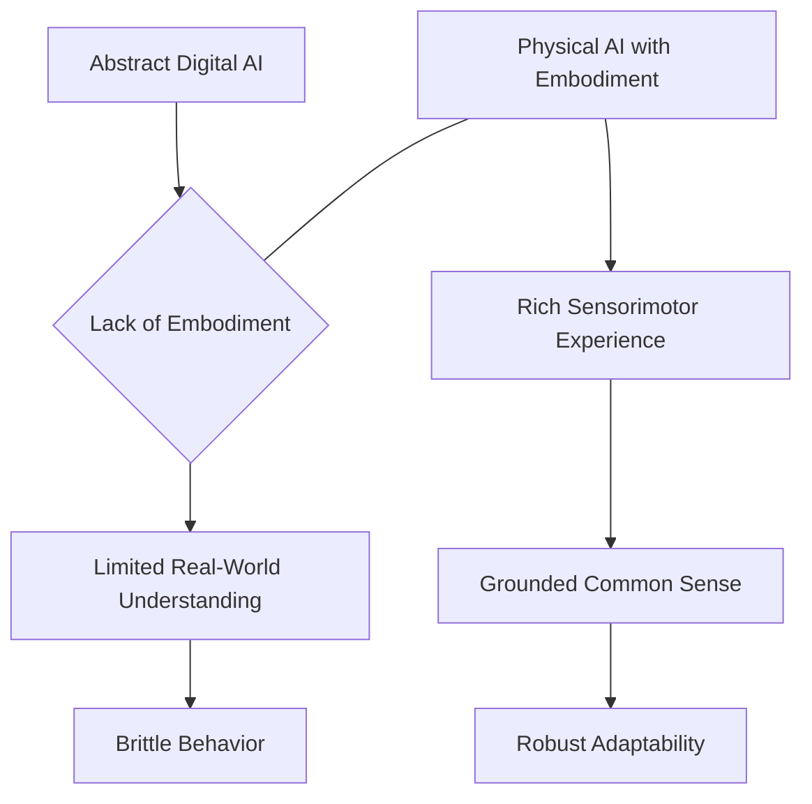

## From Digital to Embodied Intelligence

💬 **Theory Insight: The Necessity of a Body for Advanced AI**

For decades, artificial intelligence research primarily focused on symbolic reasoning, expert systems, and abstract problem-solving within purely digital environments. While these approaches yielded significant breakthroughs, they often struggled with tasks requiring common sense, intuitive physics, and real-world adaptability—areas where humans effortlessly excel. This limitation stems from a lack of *embodiment*.

Embodied intelligence posits that a physical body interacting with its environment is not merely a vessel for intelligence, but an integral part of its development. A robot's experiences with gravity, friction, objects, and spatial relationships provide a rich, multi-modal dataset that is fundamentally different from curated digital datasets. This direct interaction helps build a grounded understanding of causality, consequences, and the very fabric of reality. Without a body, an AI cannot truly 'understand' what it means to push an object, feel its weight, or navigate a complex terrain. This deficiency leads to brittle AI systems that fail when confronted with unforeseen variations in the real world.

### Digital vs. Embodied AI

| Feature             | Digital AI (Traditional)                      | Embodied AI (Physical AI)                             |
|---------------------|-----------------------------------------------|-------------------------------------------------------|
| **Primary Domain**  | Abstract, symbolic, computational environments | Physical world interaction, real-time sensing & action |
| **Learning Source** | Curated datasets, simulations, rules          | Sensorimotor experience, environmental interaction    |
| **Key Strengths**   | Logic, data analysis, pattern recognition     | Adaptability, common sense, intuitive physics         |
| **Challenges**      | Grounding in reality, generalization          | Hardware complexity, real-time constraints, safety    |



🎓 **Key Insight: The Sensorimotor Loop as the Foundation of Learning**

The fundamental mechanism through which embodied intelligence develops is the *sensorimotor loop*. This continuous cycle involves perceiving the environment through sensors, processing that information, deciding on an action, executing that action through actuators, and then observing the consequences of that action through the same (or different) sensors. This loop is how biological organisms learn about their world, develop motor skills, and build predictive models of their environment. For robots, replicating this loop, particularly with advanced AI models guiding the decision-making, is crucial for autonomous learning and adaptation.

For example, a robot attempting to pick up a new object will use its vision sensors to locate it, its depth sensors to estimate distance, and its tactile sensors to gauge grip force. The outcome of its grasping action (success or failure, how the object feels) feeds back into its internal model, refining its motor control and object manipulation strategies for future attempts. This iterative process of *act-sense-learn* is the cornerstone of embodied intelligence.

### Code Example: Conceptual Sensorimotor Loop (Python)

This Python code illustrates a conceptual sensorimotor loop. In a real ROS 2 or Isaac Sim environment, the `sense` and `act` functions would be replaced with calls to their respective APIs.

```python
import time
import random

class EmbodiedAgent:
    def __init__(self):
        print("Embodied agent initialized.")
        self.internal_state = {"position": [0, 0, 0], "perception_quality": 0.0}

    def sense_environment(self):
        # Simulate receiving sensor data from ROS 2 topics or Isaac Sim streams
        time.sleep(0.1) # Simulate sensor latency
        sensor_data = {
            "object_detected": random.choice([True, False]),
            "distance_to_object": random.uniform(0.1, 5.0),
            "light_level": random.uniform(0.1, 1.0)
        }
        self.internal_state["perception_quality"] = sensor_data["light_level"]
        print(f"Sense: {sensor_data}")
        return sensor_data

    def decide_action(self, sensed_data):
        # Simple decision logic based on perceived state
        if sensed_data["object_detected"] and sensed_data["distance_to_object"] < 1.0:
            action_command = "approach_object"
        else:
            action_command = "explore_area"
        print(f"Decide: {action_command}")
        return action_command

    def execute_action(self, action_command):
        # Simulate sending commands to ROS 2 actuators or Isaac Sim control APIs
        time.sleep(0.2) # Simulate actuation time
        print(f"Execute: {action_command}")
        # Update internal state based on action (simplified)
        if action_command == "approach_object":
            self.internal_state["position"][0] += 0.1 # Move conceptually

# Run the sensorimotor loop
agent = EmbodiedAgent()
for _ in range(5): # Simulate 5 cycles
    sensed = agent.sense_environment()
    action = agent.decide_action(sensed)
    agent.execute_action(action)
    print(f"Current internal state: {agent.internal_state}\n")
```

🤝 **Practice: Simulating a Robotic Action via FastAPI**

Building upon the idea of a sensorimotor loop, let's conceptualize how our FastAPI backend would mediate a robot's action based on perceived digital intelligence. This practice involves extending our simulated `curl` interaction to trigger a more specific, albeit still simulated, robotic movement. This would eventually connect to ROS 2 for real control.

### `curl` Example: Triggering a Simulated Robot Movement

Imagine a `/robot/move` endpoint in our FastAPI backend (`backend/main.py`) that accepts a target position or movement command and returns a status confirming the action has been initiated in the simulation.

```bash
# Placeholder curl command - replace with actual FastAPI endpoint once ready
# Ensure your FastAPI backend (backend/main.py) is running (e.g., uvicorn main:app --reload)

curl -X POST \\
  http://127.0.0.1:8000/robot/move \\
  -H "Content-Type: application/json" \\
  -d '{
    "target_position": {"x": 1.0, "y": 0.5, "z": 0.0},
    "movement_type": "walk_to_target",
    "speed": "normal"
  }'
```

**Expected (Simulated) FastAPI Response:**

```json
{
  "status": "action_initiated",
  "command_id": "move-xyz-12345",
  "estimated_completion_time": 5.5
}
```

This `curl` call demonstrates how a digital command (e.g., from a high-level AI planner or even a user interface) could initiate a physical action. The FastAPI backend acts as the crucial intermediary, receiving abstract goals and translating them into executable commands for a robot within a simulation environment like Gazebo or Isaac Sim. This endpoint would eventually be powered by the backend agent to process voice commands into robot actions.

Ask your AI: Extend the basic FastAPI application in `backend/main.py` with a new endpoint `/robot/move` that accepts the JSON payload from the `curl` example and returns the simulated JSON response. Include necessary Pydantic models for request and response validation.