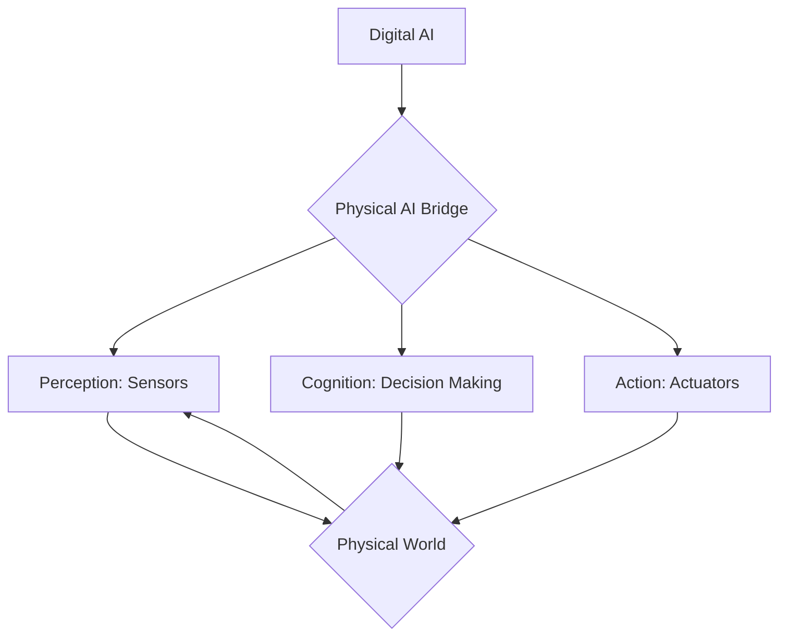

## Foundations of Physical AI

💬 **Theory Insight: The Bridge from Digital to Physical**

Physical AI represents a paradigm shift from purely computational intelligence to systems that are deeply integrated with the physical world. Unlike traditional AI that primarily operates within software environments, Physical AI embodies intelligence in physical forms—robots, drones, and autonomous vehicles—enabling them to perceive, reason, and act in real-world scenarios. This field marries advancements in machine learning, computer vision, and natural language processing with robotics, control theory, and hardware engineering.

The core challenge in Physical AI is effectively translating abstract digital commands and learned behaviors into precise physical actions, while simultaneously interpreting complex sensor data from dynamic, unpredictable environments. This requires robust feedback loops, real-time decision-making capabilities, and a deep understanding of physics and material interactions. The goal is to create truly autonomous systems that can perform complex tasks, adapt to novel situations, and safely interact with humans and other agents in their operational space.



### Key Components of Physical AI

| Component       | Role                                                                | Examples                                      |
|-----------------|---------------------------------------------------------------------|-----------------------------------------------|
| **Perception**  | Gathering information about the environment                         | Cameras, LiDAR, IMUs, tactile sensors         |
| **Cognition**   | Processing information, planning, learning, and decision-making     | Neural Networks, Reinforcement Learning, SLAM |
| **Action**      | Executing physical movements and manipulations                      | Motors, Servos, Grippers, Bipedal Legs        |
| **Interaction** | Engaging with humans and other physical entities                    | Haptic feedback, Voice commands, Gestures     |

🎓 **Key Insight: Embodiment as a Prerequisite for General Intelligence**

One of the profound insights in Physical AI is the growing realization that embodiment might not just be an application area for AI, but a prerequisite for achieving truly general intelligence. An AI system confined to a digital realm, no matter how powerful, lacks the fundamental experiences of physical interaction—gravity, friction, material properties, causality. These experiences provide a rich, multi-modal dataset that is essential for developing common sense, intuitive physics, and a deeper understanding of the world. Robots, by their very nature, are forced to grapple with these complexities, leading to a more grounded and robust form of intelligence. This grounding is critical for developing truly autonomous and adaptable systems that can learn and generalize in ways that purely digital agents cannot.

### Code Example: Basic Python AI Model (Placeholder)

This code snippet demonstrates a very basic Python AI model structure. In a real Physical AI system, this model would interact with sensor data and output control commands.

```python
import numpy as np

class SimplePhysicalAI:
    def __init__(self, num_sensors, num_actions):
        self.weights = np.random.rand(num_sensors, num_actions)

    def perceive(self, sensor_data):
        # In a real robot, this would process camera, LiDAR, etc.
        print(f"Sensor data received: {sensor_data}")
        return sensor_data

    def decide_action(self, processed_data):
        # Simple decision: weighted sum of inputs
        action = np.dot(processed_data, self.weights)
        print(f"Decided action: {action}")
        return action

    def execute_action(self, action):
        # In a real robot, this would control motors/actuators
        print(f"Executing action: {action}")
        # Placeholder for ROS 2 / Isaac Sim integration

# Example usage
ai_agent = SimplePhysicalAI(num_sensors=3, num_actions=2)
sensor_input = np.array([0.5, 0.2, 0.8])

perceived_data = ai_agent.perceive(sensor_input)
decided_movement = ai_agent.decide_action(perceived_data)
ai_agent.execute_action(decided_movement)
```

This `SimplePhysicalAI` class serves as a conceptual model. In actual robotics, the `perceive`, `decide_action`, and `execute_action` methods would integrate with ROS 2 nodes, Gazebo, or Isaac Sim APIs for real-time sensor data, control commands, and physics simulation.


🤝 **Practice: Integrating a Basic AI into the FastAPI Backend**

For a truly interactive Physical AI textbook, we'll need our digital AI models to communicate with a backend that can, in turn, interface with robotics simulations. This practice exercise involves simulating a `curl` command to interact with our (yet-to-be-fully-implemented) FastAPI backend. Imagine this backend receives sensor data, passes it to an AI model, and then returns an action.

### `curl` Example: Simulate Sensor Data to FastAPI

Assume our FastAPI backend has an endpoint `/robot/action` that expects a JSON payload representing sensor data and returns a suggested action.

```bash
# Placeholder curl command - replace with actual FastAPI endpoint once ready
# Ensure your FastAPI backend (backend/main.py) is running (e.g., uvicorn main:app --reload)

curl -X POST \\
  http://127.0.0.1:8000/robot/action \\
  -H "Content-Type: application/json" \\
  -d '{
    "sensor_readings": {
      "lidar_front": 0.8,
      "camera_objects": ["red_ball", "blue_box"],
      "imu_orientation": {"x": 0.1, "y": 0.0, "z": 0.0, "w": 0.99}
    }
  }'
```

**Expected (Simulated) FastAPI Response:**

```json
{
  "action": {
    "command": "move_forward",
    "speed": 0.5,
    "duration": 2.0
  },
  "ai_model_confidence": 0.92
}
```

This `curl` command simulates the interaction. Once our FastAPI backend in `backend/main.py` is operational, it will parse this input, potentially use an AI model (like the `SimplePhysicalAI` above, adapted for the backend), and formulate a real or simulated robot action. This is the first step in building the voice-to-action pipeline mentioned in the project vision.

Ask your AI: Generate a Python code snippet that defines a basic FastAPI endpoint `/robot/action` that accepts the JSON payload from the `curl` example and returns the simulated JSON response. This endpoint should be added to `backend/main.py`.