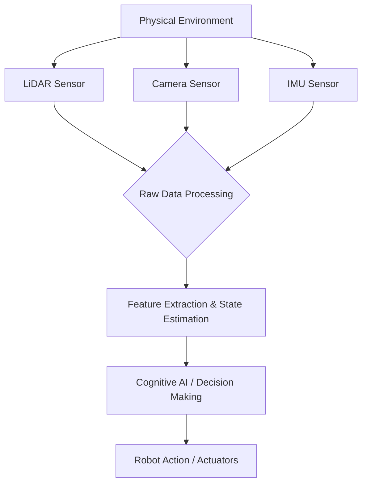

## Sensor Systems (LIDAR, Cameras, IMUs)

💬 **Theory Insight: The Robot's Senses**

For a humanoid robot to interact intelligently with its environment, it must first be able to perceive it. Sensor systems are the robot's 'senses,' providing crucial data about the physical world. Just as humans rely on sight, hearing, and touch, robots employ a variety of sensors to gather information. These sensors can be broadly categorized by the type of physical phenomenon they measure:

1.  **LiDAR (Light Detection and Ranging)**: LiDAR sensors emit pulsed laser light and measure the time it takes for the light to return to the sensor. This allows them to create precise 3D maps of the environment, identifying obstacles, mapping terrain, and localizing the robot within that map. They are highly effective in various lighting conditions and are fundamental for navigation and obstacle avoidance.

2.  **Cameras (Monocular, Stereo, RGB-D)**: Cameras capture visual information, providing rich data about colors, textures, and object identities. Monocular cameras offer 2D images, while stereo cameras (like human eyes) can infer depth by comparing two images. RGB-D cameras (e.g., Intel RealSense, Microsoft Kinect) directly provide both color (RGB) and depth (D) information, making them invaluable for object recognition, manipulation, and human-robot interaction.

3.  **IMUs (Inertial Measurement Units)**: IMUs are compact electronic devices that measure a robot's orientation, angular velocity, and linear acceleration. They typically combine accelerometers (detect linear acceleration), gyroscopes (detect angular velocity), and sometimes magnetometers (detect magnetic fields to provide heading information). IMUs are critical for maintaining balance, estimating joint angles, and robust state estimation, especially in dynamic movements like walking or running.

### Sensor Data Flow



### Comparison of Key Robotic Sensors

| Sensor Type | Advantages                                       | Disadvantages                                      | Typical Applications                               |
|-------------|--------------------------------------------------|----------------------------------------------------|----------------------------------------------------|
| **LiDAR**   | Accurate 3D mapping, unaffected by lighting      | Expensive, susceptible to rain/fog, no color info  | Autonomous navigation, SLAM, obstacle avoidance    |
| **Cameras** | Rich visual info (color, texture), object ID     | Affected by lighting, computationally intensive    | Object recognition, human-robot interaction, visual servoing |
| **IMUs**    | High-frequency motion data, compact              | Accumulates drift over time, sensitive to vibrations | Balance, localization, motion tracking, pose estimation |

🎓 **Key Insight: Sensor Fusion for Robust Perception**

No single sensor can provide a complete and perfect understanding of a robot's environment. Each sensor has its strengths and weaknesses. For instance, cameras offer rich semantic information but struggle with precise depth in certain conditions, while LiDAR provides accurate geometry but no color. IMUs give excellent short-term motion data but drift over long periods. The true power of robotic perception comes from *sensor fusion*—the process of combining data from multiple sensors to obtain a more accurate, reliable, and comprehensive understanding of the environment and the robot's state.

Sensor fusion algorithms (e.g., Kalman Filters, Extended Kalman Filters, Particle Filters) intelligently weigh and integrate heterogeneous sensor data to overcome individual sensor limitations. For a humanoid robot, fusing camera data for object recognition with LiDAR data for accurate 3D mapping, and IMU data for precise pose estimation, creates a robust perception system capable of navigating complex, dynamic environments. This redundancy and complementarity are vital for the robot's safety, autonomy, and ability to recover from individual sensor failures.

### Code Example: Simulating Sensor Data in Python

This Python script simulates the generation of data from a LiDAR, Camera, and IMU. In a ROS 2 environment, these would be published on respective topics.

```python
import time
import random
import math

class SimulatedSensorSuite:
    def __init__(self):
        print("Simulated sensor suite initialized.")

    def get_lidar_data(self):
        # Simulate a 360-degree LiDAR scan with random distances
        angles = [i * (math.pi / 180.0) for i in range(0, 360, 10)]
        ranges = [round(random.uniform(0.1, 10.0), 2) for _ in angles]
        print(f"LiDAR data (sample): {ranges[0:5]}...")
        return {"angles": angles, "ranges": ranges}

    def get_camera_data(self):
        # Simulate detecting objects in a camera feed
        objects = random.sample(["chair", "table", "person", "cup", "wall"], k=random.randint(0, 3))
        print(f"Camera data: Objects detected: {objects}")
        return {"objects": objects, "image_dimensions": "1920x1080"}

    def get_imu_data(self):
        # Simulate IMU readings: acceleration (m/s^2) and angular velocity (rad/s)
        acceleration = {"x": random.uniform(-0.1, 0.1), "y": random.uniform(-0.1, 0.1), "z": 9.81 + random.uniform(-0.05, 0.05)}
        angular_velocity = {"x": random.uniform(-0.01, 0.01), "y": random.uniform(-0.01, 0.01), "z": random.uniform(-0.1, 0.1)}
        print(f"IMU data: Accel={acceleration['z']:.2f}, AngVel={angular_velocity['z']:.2f}")
        return {"acceleration": acceleration, "angular_velocity": angular_velocity}

# Example usage
sensors = SimulatedSensorSuite()

for _ in range(3):
    print("--- New Sensor Cycle ---")
    sensors.get_lidar_data()
    sensors.get_camera_data()
    sensors.get_imu_data()
    time.sleep(1) # Simulate time between readings
```

🤝 **Practice: Sending Fused Sensor Data to FastAPI for Processing**

This practice exercise focuses on simulating a client-side (or robot-side) aggregation of sensor data and sending it to our FastAPI backend. The goal is to simulate a scenario where a robot collects data from multiple sensors, performs a basic local fusion, and then dispatches this comprehensive payload to a central AI processing unit (our backend) for higher-level decision-making.

### `curl` Example: Sending Fused Sensor Data

Assume our FastAPI backend in `backend/main.py` has an endpoint `/robot/sensor_fusion` that accepts a combined JSON payload of sensor data.

```bash
# Placeholder curl command - replace with actual FastAPI endpoint once ready
# Ensure your FastAPI backend (backend/main.py) is running (e.g., uvicorn main:app --reload)

curl -X POST \\
  http://127.0.0.1:8000/robot/sensor_fusion \\
  -H "Content-Type: application/json" \\
  -d '{
    "timestamp": "2025-12-07T12:34:56Z",
    "fused_data": {
      "lidar_scan_summary": "obstacle_at_2m_front",
      "detected_objects": [{"name": "red_ball", "confidence": 0.95}],
      "robot_pose_estimate": {"x": 0.1, "y": 0.2, "z": 0.0, "roll": 0.0, "pitch": 0.0, "yaw": 0.15}
    },
    "battery_level": 0.85
  }'
```

**Expected (Simulated) FastAPI Response:**

```json
{
  "status": "sensor_data_received_and_processed",
  "suggested_action": {
    "command": "adjust_heading",
    "angle": 0.1
  }
}
```

This `curl` command represents a crucial step in the robot's operational cycle: sending its current, fused perception of the world to an intelligent backend. The FastAPI service would then perform more complex AI analyses (e.g., path planning, high-level task allocation) based on this comprehensive sensor data. This practice prepares us for building the robust communication backbone of our Physical AI system.

Ask your AI: Implement a new FastAPI endpoint `/robot/sensor_fusion` in `backend/main.py` that accepts the fused sensor data payload from the `curl` example. It should log the received data and return the simulated JSON response, including appropriate Pydantic models.