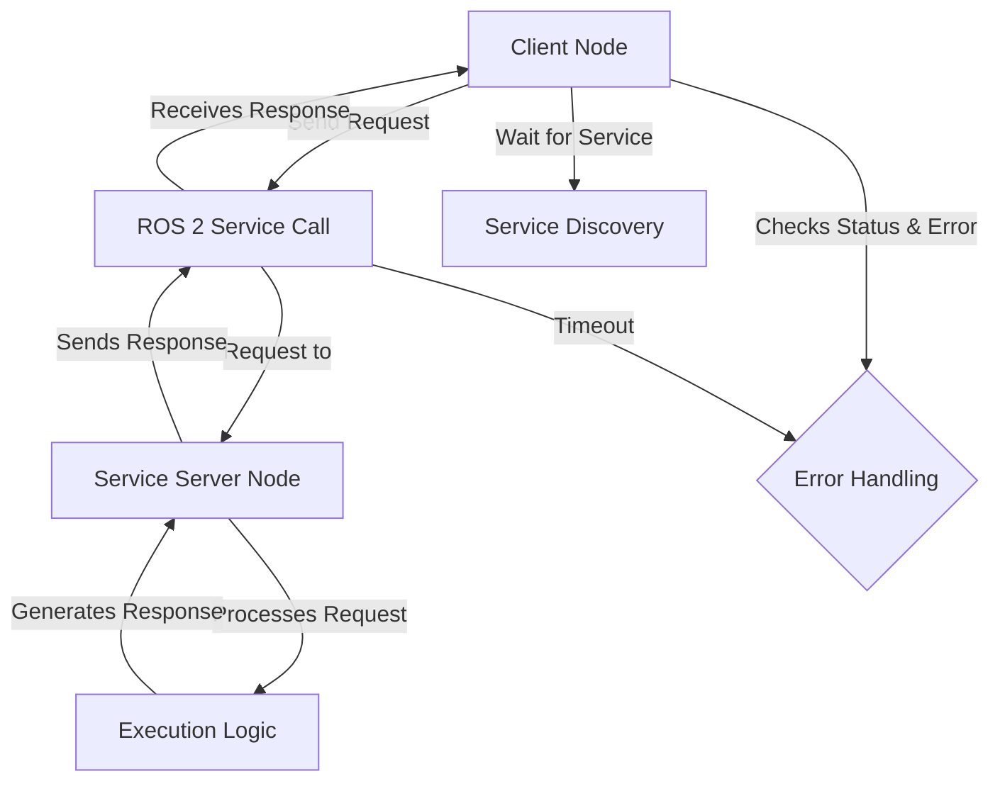

## ROS 2 Services: Deeper Dive

💬 **Theory Insight: Designing Robust Request-Response Interactions**

Building upon our introduction to ROS 2 services in Week 4, this lesson delves deeper into the nuances of designing and implementing robust request-response communication. While the basic concept of a client sending a request and a server returning a response seems straightforward, ensuring reliability, responsiveness, and clear error handling in a distributed robotic system requires careful consideration.

Key aspects of advanced service design include:

-   **Synchronous vs. Asynchronous Clients**: While service calls are inherently synchronous (client waits for response), clients can be implemented to wait in a separate thread or with non-blocking calls (e.g., using futures in `rclpy`) to prevent blocking the main execution loop. This is crucial for maintaining robot responsiveness.
-   **Error Handling and Feedback**: A service response should always provide clear status (success/failure) and detailed error messages. This allows client nodes to react appropriately, log issues, and potentially retry or escalate problems.
-   **Service Call Timeouts**: Implementing timeouts on the client side is essential to prevent indefinite waiting if a service server is unresponsive or takes too long to process a request.
-   **Service Availability**: Clients often need to check if a service server is available before attempting a call. ROS 2 provides mechanisms for clients to wait for a service to become available.

Designing services with these considerations in mind leads to more fault-tolerant and user-friendly robotic applications, especially when orchestrating complex behaviors on humanoid robots.

### Advanced Service Call Flow



### Best Practices for Service Definitions

| Practice                  | Description                                                                     | Benefit for Robotics                                          |
|---------------------------|---------------------------------------------------------------------------------|---------------------------------------------------------------|
| **Atomic Operations**     | Each service performs a single, well-defined task.                              | Easier to test, debug, and combine; reduces side effects.     |
| **Clear Request/Response** | Message types are explicit and contain all necessary/relevant data.             | Prevents ambiguity, improves interoperability.                |
| **Status & Error Codes**  | Responses include boolean `success` and `message` or explicit error codes.      | Enables robust client-side error handling and recovery.       |
| **Idempotency**           | Calling the service multiple times with same input has same effect.             | Improves reliability in retry mechanisms.                     |
| **Documentation**         | Clearly document service purpose, inputs, outputs, and potential errors.        | Facilitates integration by other developers and AI agents.    |

🎓 **Key Insight: The Interplay of Services with Action Servers for Complex Tasks**

While services are excellent for atomic, synchronous operations, they are not designed for long-running, interruptible, or feedback-rich tasks. This is where ROS 2 Actions come into play (which we'll cover in detail next). However, services often play a crucial role in *triggering* or *configuring* Action Servers. For example, a service might be used to:

-   **Start/Stop an Action**: A service could be `start_navigation` or `stop_grasping`, which internally initiates or terminates a complex navigation or grasping action managed by an Action Server.
-   **Change Action Parameters**: A service like `set_navigation_speed` could dynamically adjust the maximum velocity parameter for a currently running navigation action.
-   **Query Action Status**: A service might provide a high-level overview of active actions, while the action feedback provides granular updates.

Understanding this interplay allows for the creation of highly modular and hierarchical robot control architectures. Services handle the immediate, command-and-control aspects, while Action Servers manage the intricate, protracted behaviors, providing feedback throughout their execution. This separation of concerns is fundamental for building adaptable and robust humanoid robot behaviors.

### Code Example: ROS 2 Service Client (Python)

This Python code defines a basic ROS 2 service client that calls the `AddTwoInts` service from our previous lesson. It demonstrates waiting for the service and sending a request.

```python
# File: ros2_ws/src/simple_service_pkg/simple_service_pkg/add_two_ints_client.py

import rclpy
from rclpy.node import Node
from rclpy.qos import QoSProfile, ReliabilityPolicy, HistoryPolicy
from example_interfaces.srv import AddTwoInts

class AddTwoIntsServiceClient(Node):

    def __init__(self):
        super().__init__('add_two_ints_client')
        self.client = self.create_client(AddTwoInts, 'add_two_ints')
        # Wait for the service to be available
        while not self.client.wait_for_service(timeout_sec=1.0):
            self.get_logger().info('Service "add_two_ints" not available, waiting...')
        self.get_logger().info('Service "add_two_ints" available.')

    def send_request(self, a, b):
        request = AddTwoInts.Request()
        request.a = a
        request.b = b
        self.future = self.client.call_async(request) # Asynchronous call
        rclpy.spin_until_future_complete(self, self.future)
        return self.future.result()

def main(args=None):
    rclpy.init(args=args)
    add_two_ints_client = AddTwoIntsServiceClient()

    # Send a request
    response = add_two_ints_client.send_request(10, 5)
    if response is not None:
        add_two_ints_client.get_logger().info(f'Result of add_two_ints: for 10 + 5 = {response.sum}')
    else:
        add_two_ints_client.get_logger().error('Service call failed.')

    add_two_ints_client.destroy_node()
    rclpy.shutdown()

if __name__ == '__main__':
    main()
```

To run this client:
1.  Ensure your `AddTwoIntsServiceServer` (from Week 4) is running in one terminal.
2.  Build your ROS 2 workspace.
3.  Source your ROS 2 environment.
4.  Run: `ros2 run simple_service_pkg add_two_ints_client`

You should see the client waiting for the service, sending a request, and then printing the sum.

🤝 **Practice: Service-Oriented Backend for Robot Tasks via FastAPI**

To allow high-level AI agents (like our VLA model backend) or external user interfaces to trigger specific robot tasks, our FastAPI backend will expose service-like endpoints. This practice involves extending `backend/main.py` with an endpoint that simulates calling a ROS 2 service to perform a simple robot task, providing immediate feedback.

### `curl` Example: Performing a Simulated Robot Calibration

Assume our FastAPI backend (`backend/main.py`) has an endpoint `/robot/calibrate` that, when invoked, simulates a call to a ROS 2 service like `robot_calibration_service` and returns its status.

```bash
# Placeholder curl command - replace with actual FastAPI endpoint once ready
# Ensure your FastAPI backend (backend/main.py) is running (e.g., uvicorn main:app --reload)

curl -X POST \\
  http://127.0.0.1:8000/robot/calibrate \\
  -H "Content-Type: application/json" \\
  -d '{
    "calibration_type": "imu_recalibration",
    "execute_check": true
  }'
```

**Expected (Simulated) FastAPI Response:**

```json
{
  "status": "success",
  "message": "IMU recalibration initiated and check passed.",
  "calibration_id": "imu-cal-20251207-001"
}
```

This `curl` command simulates a request to the FastAPI backend to initiate a robot calibration task. In a real scenario, this FastAPI endpoint would serve as a client to a ROS 2 service, passing the request parameters and returning the service's response. This pattern is essential for enabling our VLA model to issue specific, immediate commands to the robot system through the backend.

Ask your AI: Implement a new FastAPI endpoint `/robot/calibrate` in `backend/main.py` that accepts a JSON payload for `calibration_type` and `execute_check`. It should simulate the call to a ROS 2 calibration service and return the simulated JSON response, including appropriate Pydantic models for request and response validation.