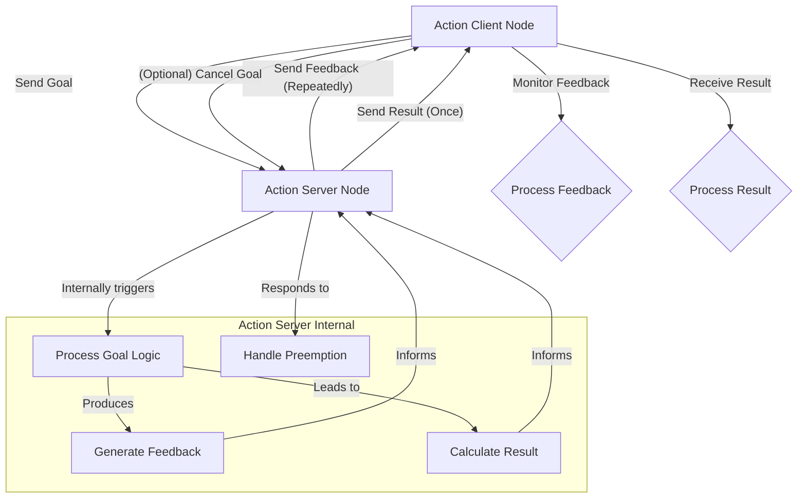

## ROS 2 Actions: Goal-Oriented, Asynchronous Tasks

💬 **Theory Insight: Managing Complex Robot Behaviors**

While ROS 2 topics provide continuous data streams and services offer synchronous request-response interactions, many robotic tasks require a more sophisticated communication pattern: **goal-oriented, asynchronous execution with continuous feedback and the ability to be preempted**. This is precisely what ROS 2 Actions are designed for. Actions are built on top of topics and services, providing a higher-level abstraction for long-running tasks like "navigate to a point," "pick up an object," or "perform a complex manipulation sequence."

Key components of ROS 2 Actions:

-   **Action Server**: A node that offers an action. It receives goals from clients, processes them, provides continuous feedback as it executes the task, and ultimately sends a result. It can also handle preemption requests.
-   **Action Client**: A node that sends a goal to an action server, monitors its progress via feedback, and receives the final result. Clients can also send preemption requests to cancel an ongoing goal.
-   **Action Goal**: The input to the action server, defining the desired state or task (e.g., target coordinates for navigation).
-   **Action Feedback**: Continuous updates from the action server to the client about the current progress of the goal (e.g., current position during navigation, percentage complete).
-   **Action Result**: The final outcome of the goal, sent once the action server has completed or aborted the task (e.g., success/failure status, final position).
-   **Action Type**: Defines the structure of the goal, feedback, and result messages. Each action has a unique action type (e.g., `example_interfaces/action/Fibonacci`, `nav2_msgs/action/NavigateToPose`).
-   **Action Name**: A unique identifier for the action within the ROS graph (e.g., `/robot/navigate_to_pose`).

Actions are indispensable for complex humanoid robot behaviors where tasks are not instantaneous, require progress monitoring, and might need to be interrupted (e.g., a "stop" command during a walking action). They encapsulate the entire lifecycle of a task, making it easier to manage and debug long-running operations.

### ROS 2 Action Communication Flow



### Best Practices for Action Definitions

| Practice                      | Description                                                                       | Benefit for Robotics                                                               |\n|-------------------------------|-----------------------------------------------------------------------------------|------------------------------------------------------------------------------------|\n| **Clear Goal Definition**     | The goal message clearly specifies the desired outcome.                           | Prevents ambiguity, allows AI agents to formulate precise commands.                |\n| **Rich Feedback**             | Feedback messages provide sufficient detail for client-side monitoring/visualization. | Enables real-time progress tracking, enhances user experience and debugging.       |\n| **Comprehensive Result**      | The result message includes success/failure and any relevant final data.          | Informs subsequent high-level planning, crucial for decision-making.               |\n| **Preemptibility**            | Server can gracefully stop an ongoing goal upon client request.                   | Essential for safety and adaptability in dynamic robot environments.               |\n| **Idempotency (where applicable)** | If restarting a goal with the same input yields the same state.                   | Improves robustness in error recovery scenarios, though less common for actions.   |\n| **Minimalistic Action Types** | Avoid overly complex or monolithic action definitions.                            | Easier to test, maintain, and reuse; promotes modularity in robot behaviors.       |

🎓 **Key Insight: Orchestrating Actions for Humanoid Dexterity and Navigation**

For humanoid robots, actions are fundamental to executing complex, multi-stage behaviors. Consider tasks like:

-   **Whole-Body Manipulation**: A "grasp object" action might involve a sequence of sub-goals: reach pre-grasp pose, close gripper, lift, move to post-grasp pose. The action client receives feedback on each stage (e.g., "reaching," "grasping," "lifting") and the final result (e.g., "object grasped successfully" or "grasp failed due to slippage").
-   **Navigation in Dynamic Environments**: A "navigate to kitchen" action could involve path planning, obstacle avoidance, and potentially opening doors. Feedback would include current pose, estimated time to arrival, and detected obstacles. The client could preempt the navigation if a new, higher-priority command arrives (e.g., "stop immediately!").
-   **Human-Robot Interaction**: An "approach human" action might incorporate face tracking, safe distance maintenance, and verbal communication. Feedback could include the human's emotional state or proximity warnings.

The robust, asynchronous nature of actions, combined with continuous feedback and preemption, provides the necessary framework for developing adaptable, intelligent, and safe humanoid robot applications, especially when integrating with high-level AI planning systems like our VLA model backend.

### Code Example: ROS 2 Action Server (Python) - Fibonacci Action

This Python code defines a simple ROS 2 Action Server for calculating the Fibonacci sequence. It demonstrates receiving a goal, publishing feedback, and sending a result.

```python
# File: ros2_ws/src/simple_action_pkg/simple_action_pkg/fibonacci_action_server.py

import rclpy
from rclpy.action import ActionServer, CancelResponse, GoalResponse
from rclpy.node import Node
from example_interfaces.action import Fibonacci # Example action definition

class FibonacciActionServer(Node):

    def __init__(self):
        super().__init__('fibonacci_action_server')
        self._action_server = ActionServer(
            self,
            Fibonacci,
            'fibonacci',
            self.execute_callback,
            goal_callback=self.goal_callback,
            handle_accepted_callback=self.handle_accepted_callback,
            cancel_callback=self.cancel_callback
        )
        self.get_logger().info('Fibonacci Action Server started.')

    def goal_callback(self, goal_request):
        """Accept or reject a client request to begin an action."""
        self.get_logger().info(f'Received goal request for order {goal_request.order}')
        if goal_request.order > 50: # Arbitrary limit for demonstration
            self.get_logger().warn('Goal rejected: order too high.')
            return GoalResponse.REJECT
        self.get_logger().info('Goal accepted.')
        return GoalResponse.ACCEPT

    def handle_accepted_callback(self, goal_handle):
        """Execute a goal."""
        # This function is called in a separate thread, so we can run blocking code here
        goal_handle.execute()

    def cancel_callback(self, cancel_request):
        """Accept or reject a client request to cancel an action."""
        self.get_logger().info('Received cancel request')
        return CancelResponse.ACCEPT

    async def execute_callback(self, goal_handle):
        self.get_logger().info('Executing goal...')

        feedback_msg = Fibonacci.Feedback()
        feedback_msg.sequence = [0, 1]

        # Start executing the action
        for i in range(1, goal_handle.request.order):
            if goal_handle.is_cancel_requested:
                goal_handle.canceled()
                self.get_logger().info('Goal canceled.')
                return Fibonacci.Result() # Return empty result or specific canceled result

            feedback_msg.sequence.append(feedback_msg.sequence[i] + feedback_msg.sequence[i-1])
            self.get_logger().info(f'Feedback: {feedback_msg.sequence}')
            goal_handle.publish_feedback(feedback_msg)
            # Simulate work
            await rclpy.sleep(0.5) # Non-blocking sleep

        goal_handle.succeed()
        result = Fibonacci.Result()
        result.sequence = feedback_msg.sequence
        self.get_logger().info(f'Goal succeeded. Result: {result.sequence}')
        return result

def main(args=None):
    rclpy.init(args=args)
    fibonacci_action_server = FibonacciActionServer()
    rclpy.spin(fibonacci_action_server) # Spin until node is destroyed
    fibonacci_action_server.destroy_node()
    rclpy.shutdown()

if __name__ == '__main__':
    main()
```

To run this server:
1.  Define the action in `ros2_ws/src/simple_action_pkg/action/Fibonacci.action`:
    ```
    int32 order
    ---
    int32[] sequence
    ---
    int32[] sequence
    ```
2.  Update `ros2_ws/src/simple_action_pkg/package.xml` and `CMakeLists.txt` to build the action.
3.  Build your ROS 2 workspace.
4.  Source your ROS 2 environment.
5.  Run: `ros2 run simple_action_pkg fibonacci_action_server`

This server will wait for incoming requests to calculate Fibonacci sequences.

🤝 **Practice: Triggering a Simulated Robot Navigation Action via FastAPI**

To allow high-level AI agents (like our VLA model backend) or external user interfaces to trigger and monitor complex robot tasks, our FastAPI backend will expose action-like endpoints. This practice involves extending `backend/main.py` with an endpoint that simulates interacting with a ROS 2 navigation action, providing a way to send goals, receive feedback, and get results.

### `curl` Example: Initiating a Simulated Navigation Goal

Assume our FastAPI backend (`backend/main.py`) has an endpoint `/robot/navigate` that, when invoked, simulates sending a goal to a ROS 2 navigation action server. The FastAPI endpoint would immediately return a "goal accepted" status with a `goal_id`, and subsequent requests could poll for feedback or result.

```bash
# Placeholder curl command - replace with actual FastAPI endpoint once ready
# Ensure your FastAPI backend (backend/main.py) is running (e.g., uvicorn main:app --reload)

curl -X POST \
  http://127.0.0.1:8000/robot/navigate \
  -H "Content-Type: application/json" \
  -d '{
    "target_pose": {
      "x": 5.0,
      "y": -2.0,
      "theta": 90.0
    },
    "speed_limit": "fast",
    "collision_avoidance": true
  }'
```

**Expected (Simulated) FastAPI Response (Goal Accepted):**

```json
{
  "status": "goal_accepted",
  "message": "Navigation goal to (5.0, -2.0) initiated.",
  "goal_id": "nav-goal-20251207-001"
}
```

This `curl` command simulates sending a navigation goal. In a real scenario, this FastAPI endpoint would serve as an action client, sending the goal to a ROS 2 action server (e.g., `nav2_msgs/action/NavigateToPose`). The `goal_id` would then be used by the external client to poll for feedback and the final result from the FastAPI backend, which in turn would be polling the ROS 2 action server. This pattern is essential for enabling our VLA model to issue specific, long-running commands to the robot system through the backend and monitor their execution.

Ask your AI: Implement a new FastAPI endpoint `/robot/navigate` in `backend/main.py` that accepts a JSON payload for `target_pose`, `speed_limit`, and `collision_avoidance`. It should simulate sending a goal to a ROS 2 navigation action and return a simulated JSON response including a `goal_id`, using appropriate Pydantic models for request and response validation.
